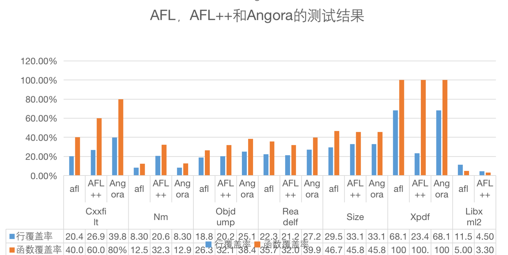
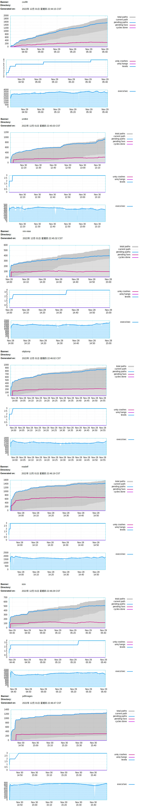
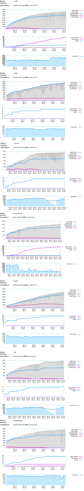

## 结果分析
我们在实现了AFL之后，实现了AFL++和Angora两个测试工具。实验在64位Ubuntu 20.04 的虚拟机上进行，我们选取了cssfilt，nm，objdump，readelf，size，xpdf，libxml2这其中7个程序作为实验对象，并对比了他们在AFL下，AFL++和Angora下的实验效果。
这七个程序的信息，以及对应的实验结果如下图1所示，其中缺失Angora对libxml2的实验结果。

总体来说，AFL++在这七个程序上，与AFL的覆盖率相差不大。其中在cxxfilt上提升了6.5%的覆盖率，nm上提升了12.3%的覆盖率，objdump上提升了1.4%，size上提升了3.6%，readelf上低了1.1%，xpdf上低了44.7%，libxml2上低了7%。在cxxfilt，nm，objdump，readelf，size，xpdf这六个程序上，Angora比AFL覆盖率提升了34.2%，相对提升20.43%，Angora比AFL++覆盖率提升了56.2%，相对提升38.65%。上述实验表明Agnora相比AFL和AFL++能提高基于覆盖率的模糊测试的最终覆盖率。

下面图2以及图3描述了AFL和AFL++在对7个目标程序进行的为期 1 小时的实验中覆盖率随时间的状态变化，纵坐标为被覆盖的边的数量，横坐标是时间，纵坐标为被覆盖的边数。在时间靠后的阶段，所有程序的覆盖率曲线接近平滑，基本不再提升，这是因为模糊测试工具完成了对大多数文件的测试，开始重复测试旧的文件所导致的。通过比对两个曲线，我们可以看到AFL++在这一个小时之内覆盖边的数量和速度都明显优于AFL，在cxxfilt，nm，objdump，size这四个程序上一直保持着覆盖率对AFL的领先态势直到测试结束。而在readelf，xpdf，libxml中，AFL++虽然仍然领先，但是我们通过分析发现, 在后三个程序的序列中, 存在一些文件，而这些文件覆盖了不少低频边, 且其他文件不经过这些边, 所以它们仍然是覆盖这些边的执行速度最快的文件。AFL++在计算优先度时将它们排在前面, 导致了AFL++提前在上面花了不少时间测试，因而覆盖率提升变慢，最终结果低于AFL。
图2
图3

其次，在测试50分钟以后，所有曲线都趋向于平滑，提升都不大，这是因为模糊测试工具完成了对大多数文件的测试, 开始重复测试旧的文件所导致的，AFL++最终曲线趋于平滑后的值都是要高于AFL的。

